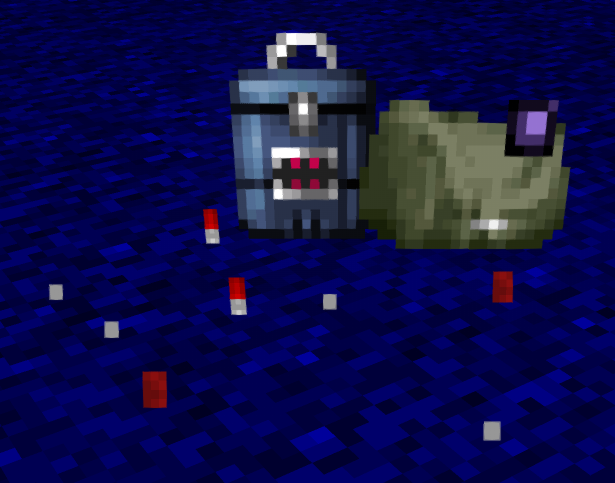
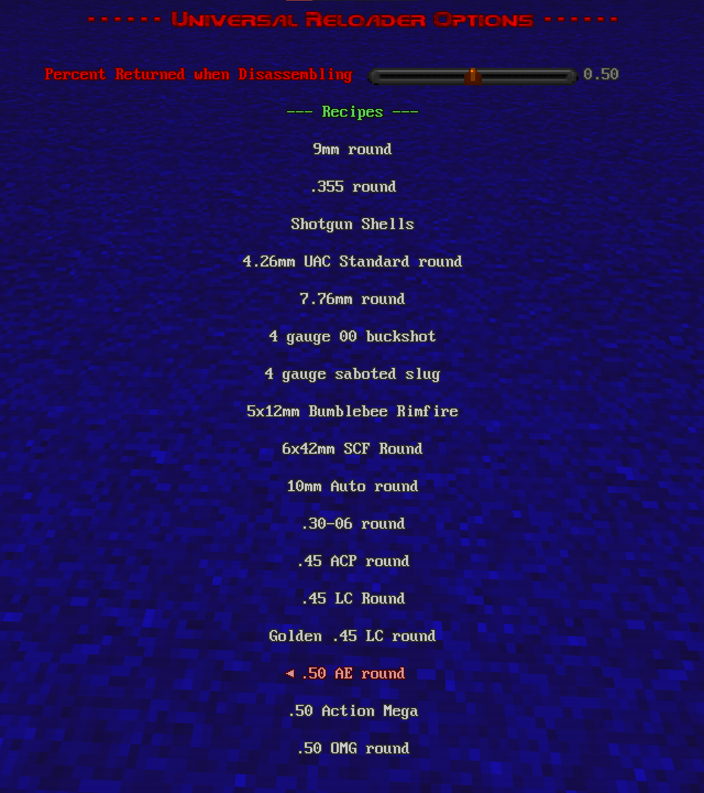
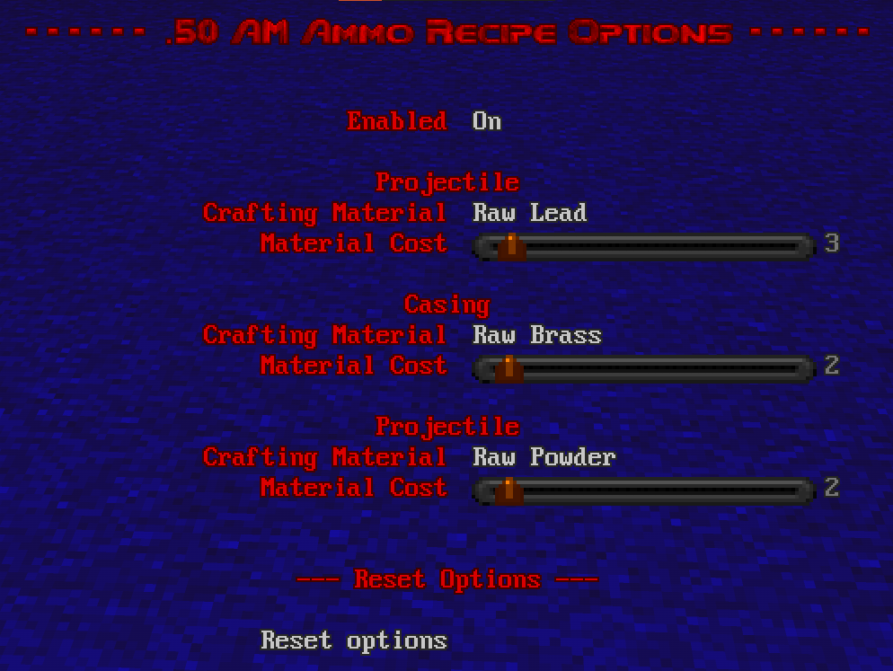
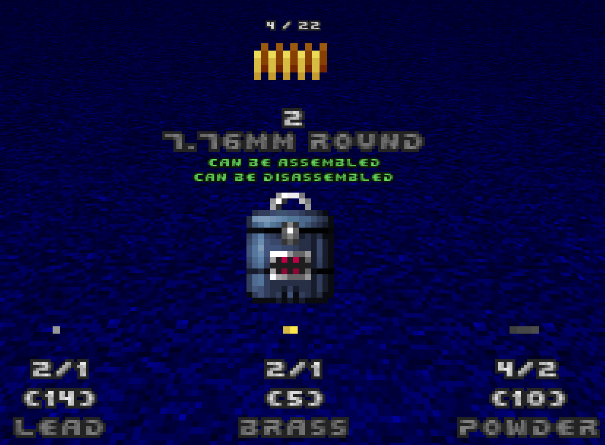
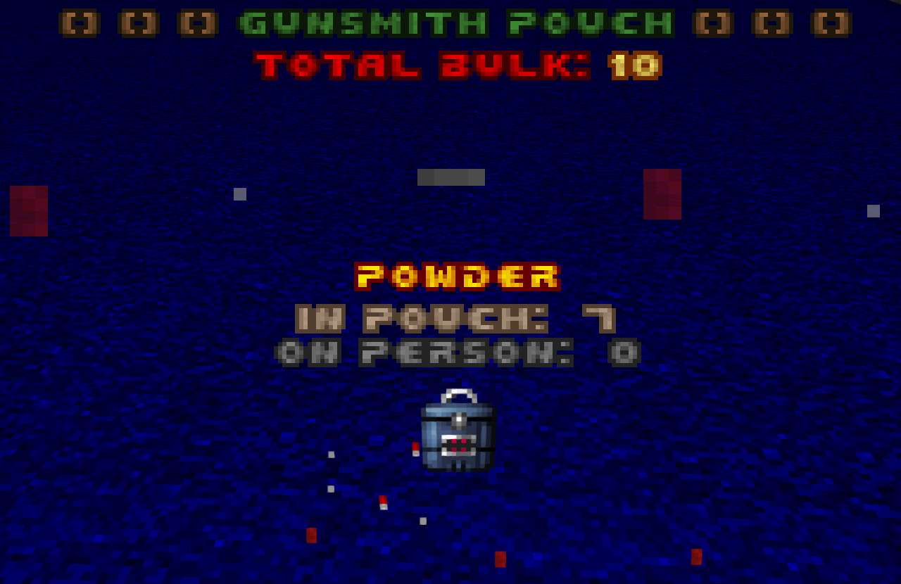

# Universal Reloader
_This mod requires [AceCoreLib](https://github.com/HDest-Community/AceCoreLib)_

This mod adds a configurale device that can assemble and disassemble most rounds provided by both Vanilla HDest as well as those provided by [HDBulletLib-Recasted](https://github.com/HDest-Community/HDBulletLib-Recasted).  Along with this device, this mod adds an accompanying pouch to store all of the crafting materials gathered/created along the way.

## Universal Reloader
- Loadout code is `url`.
- Universal reloaders can only be found in backpacks. They are also sold by the [Merchant](https://github.com/HDest-Community/Merchant) if you have that loaded.

## Gunsmith Pouch
- Loadout code is `gsp`.
- Gunsmith Pouches can be found in the wild.  They will hold the various crafting materials created by disassembling ammunition.

# Credits
#### Code
- Universal Reloader: Accensus
- Gunsmith Pouch: Mohl
  - _Based off of the Ammo Pouch by Caligari87_

#### Sprites
- Universal Reloader: Mor'ladim
- Gunsmith Pouch: Skelegant